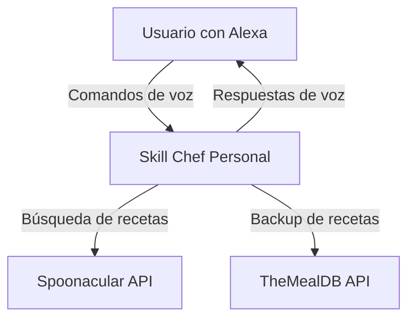
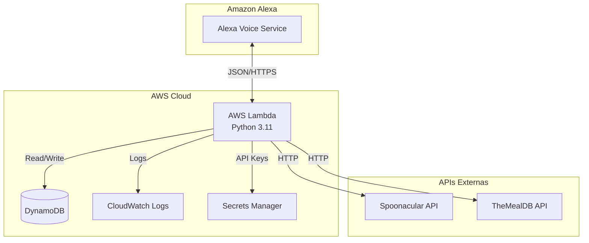
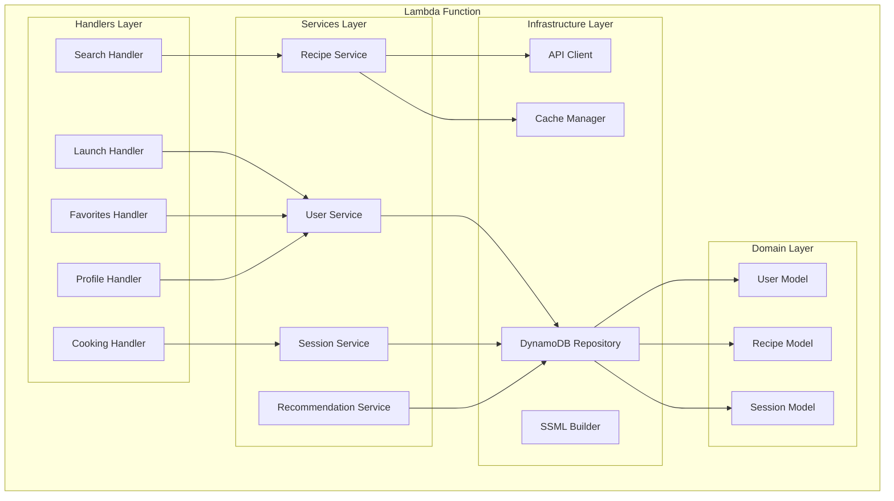
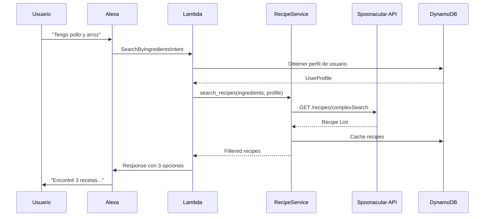
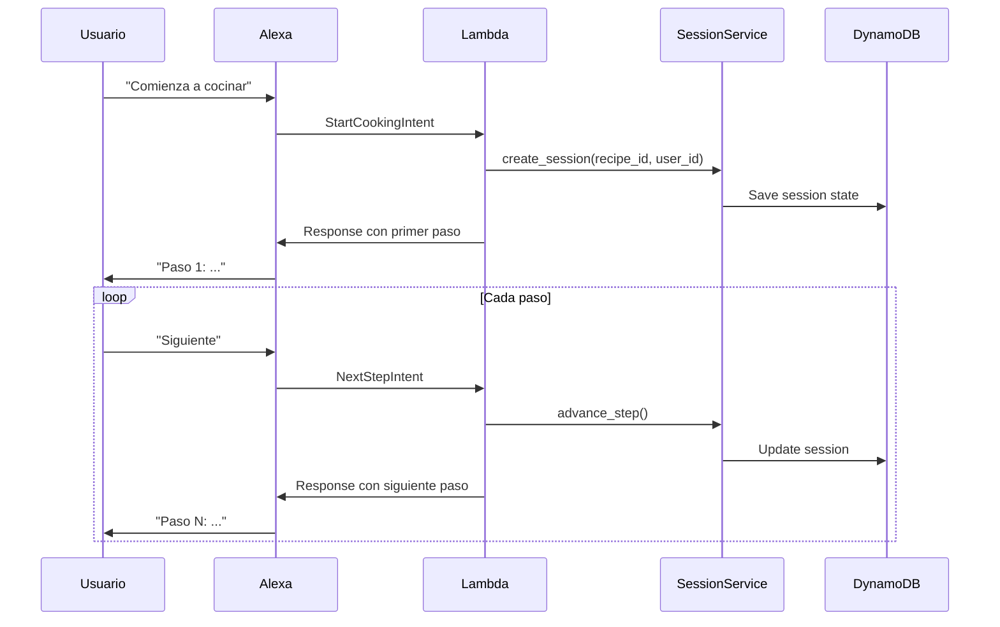
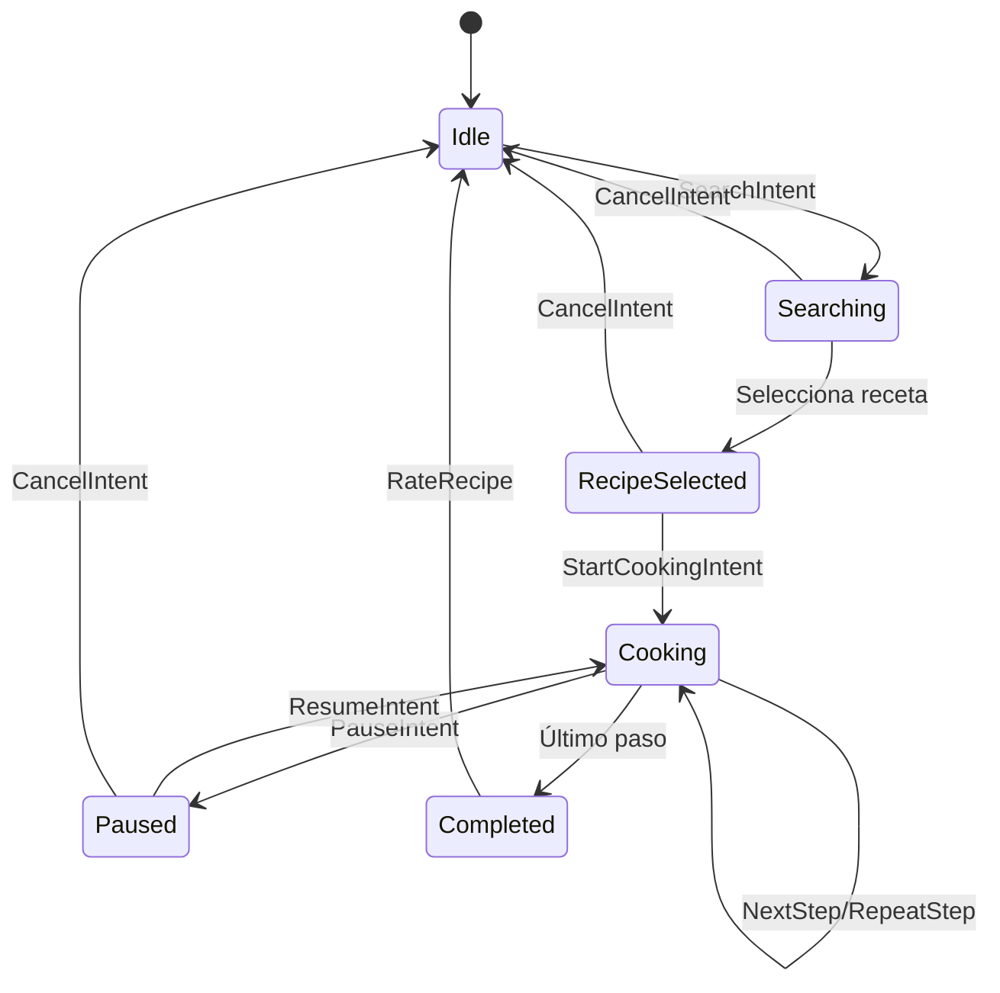
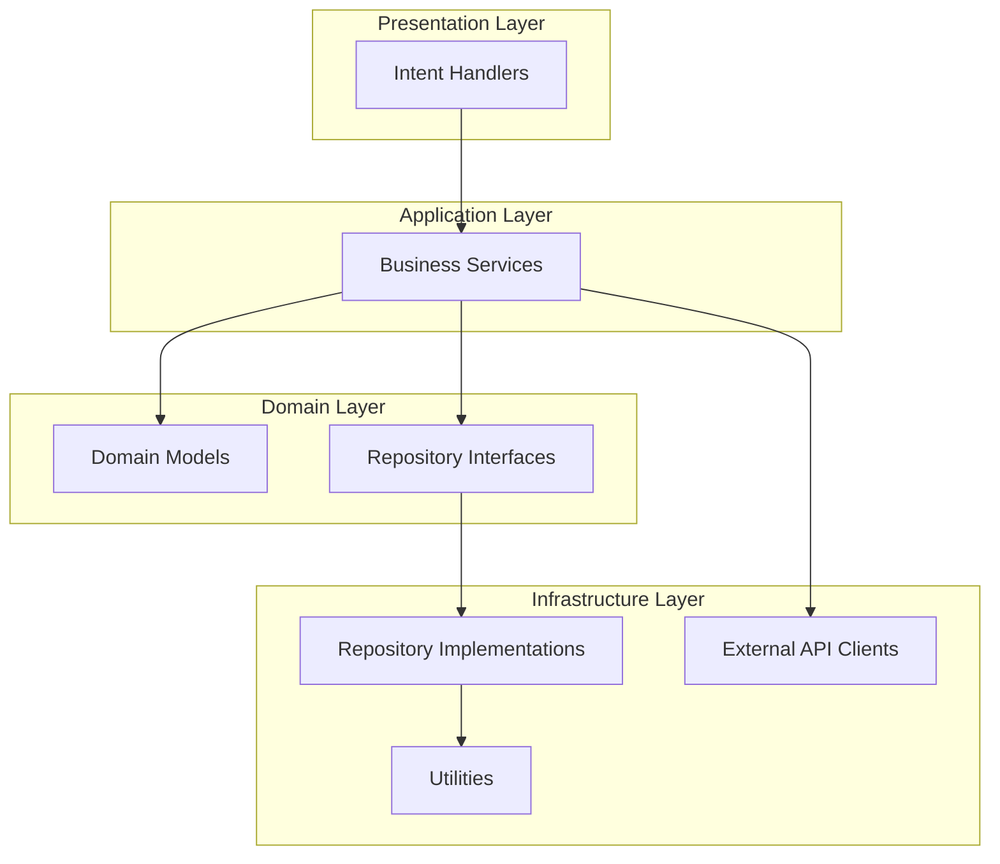
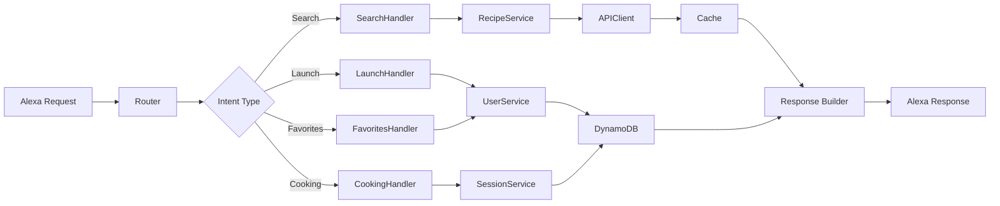

# Arquitectura del Sistema - Chef Personal

## Diagrama C4 - Nivel 1: Contexto del Sistema

## Diagrama C4 - Nivel 2: Contenedores

## Diagrama C4 - Nivel 3: Componentes

## Diagrama de Secuencia - Búsqueda de Receta

## Diagrama de Secuencia - Modo Cocina

## Diagrama de Estados - Sesión de Cocina

## Arquitectura de Capas

## Flujo de Datos

