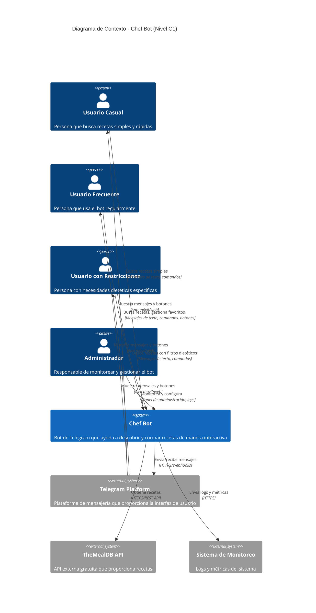
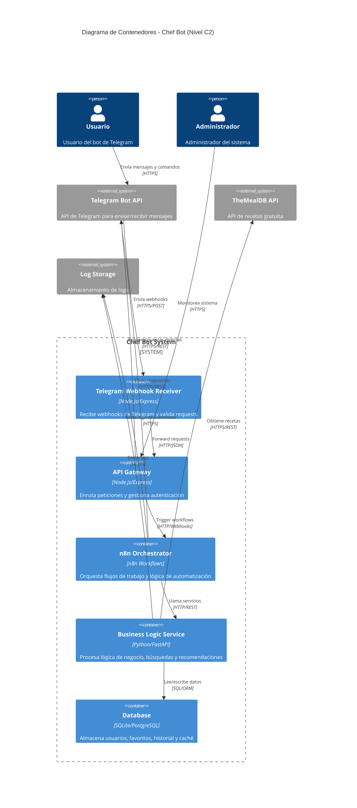
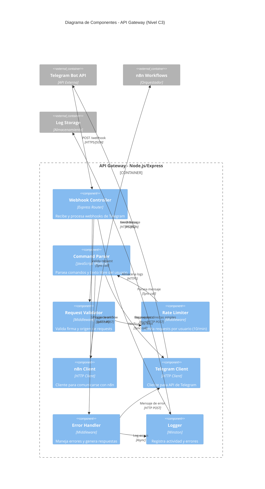
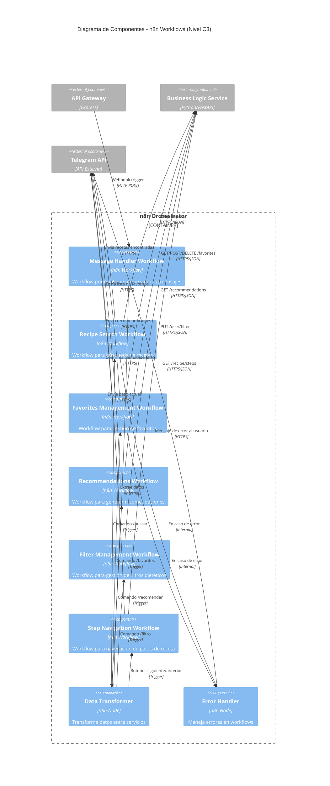
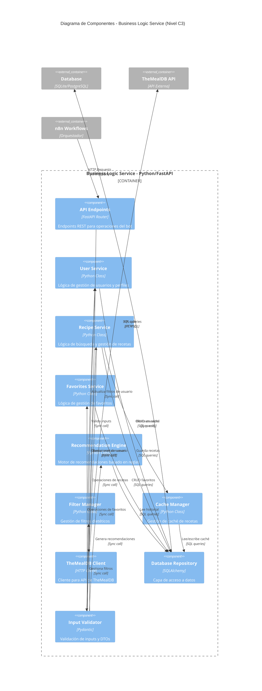

# diseno-sw-bot-telegram

# Diseño de Software - Bot de Cocina Telegram

**Versión:** 1.0

**Autor(es):** Equipo de Desarrollo - Chef Bot

**Fecha:** 28 de Noviembre de 2025

**Historial de revisiones:**


| Versión | Fecha      | Cambios                                         |
| -------- | ---------- | ----------------------------------------------- |
| 1.0      | 2025-11-28 | Documento inicial adaptado para bot de Telegram |

---

## 1. Introducción

### 1.1 Descripción general del sistema / proyecto

El “Chef Bot” es un asistente culinario inteligente implementado como bot de Telegram que ayuda a los usuarios a descubrir y cocinar recetas de manera interactiva. El sistema proporciona recomendaciones personalizadas basadas en ingredientes disponibles, restricciones dietéticas y preferencias del usuario, utilizando una arquitectura moderna con n8n para automatización, Python para lógica de negocio, y JavaScript para el API Gateway.

### 1.2 Objetivo del documento

Este documento describe el diseño técnico y funcional del bot “Chef Bot” para Telegram, estableciendo la arquitectura, requerimientos, flujos de interacción y consideraciones técnicas necesarias para su implementación en un periodo de 15 días.

### 1.3 Alcance

**Qué incluye:**

- Búsqueda de recetas por ingredientes disponibles (hasta 3 ingredientes)
- Filtros dietéticos básicos (vegetariano, vegano, sin gluten)
- Guía de recetas paso a paso mediante mensajes de Telegram
- Sistema simple de favoritos (máximo 10 por usuario)
- Recomendaciones básicas basadas en historial reciente
- Integración con API de recetas (TheMealDB - gratuita)
- Conversión básica de medidas
- Comandos de texto e interacción con botones inline

**Qué no incluye:**

- Listas de compras automáticas
- Información nutricional detallada
- Control de temporizadores externos
- Soporte multimedia avanzado (solo imágenes de recetas)
- Sistema de calificaciones complejo
- Análisis de imágenes de ingredientes
- Notificaciones programadas
- Soporte multi-idioma (solo español)

### 1.4 Actores principales

1. **Usuario Casual**: Persona que busca recetas simples y rápidas, interactúa ocasionalmente con el bot
2. **Usuario Frecuente**: Persona que usa el bot regularmente para descubrir nuevas recetas y guardar favoritos
3. **Usuario con Restricciones**: Persona con necesidades dietéticas específicas que requiere filtros especializados
4. **Administrador**: Persona responsable de monitorear el bot, gestionar logs y configuraciones
5. **Sistema n8n**: Plataforma de automatización que orquesta los flujos de trabajo
6. **API Gateway**: Capa de JavaScript que gestiona las peticiones entre Telegram y los servicios

### 1.5 Casos de uso / historias de usuario relevantes

**HU-01: Búsqueda Simple**

- **Como** usuario casual
- **Quiero** buscar recetas escribiendo los ingredientes que tengo
- **Para** aprovechar lo que hay en mi refrigerador sin desperdiciar comida
- **Criterios de aceptación**:
- Puedo enviar hasta 3 ingredientes
- Recibo al menos 2 opciones de recetas
- El tiempo de respuesta es menor a 5 segundos

**HU-02: Aplicar Filtros Dietéticos**

- **Como** usuario con restricciones alimentarias
- **Quiero** filtrar recetas por tipo de dieta
- **Para** asegurarme de que todas las sugerencias sean apropiadas para mi alimentación
- **Criterios de aceptación**:
- Puedo seleccionar entre vegetariano, vegano o sin gluten
- Solo recibo recetas que cumplen con el filtro
- El filtro se mantiene durante toda la sesión

**HU-03: Ver Receta Detallada**

- **Como** usuario interesado en cocinar
- **Quiero** ver los detalles completos de una receta
- **Para** conocer ingredientes, pasos y tiempo de preparación
- **Criterios de aceptación**:
- Veo lista completa de ingredientes con cantidades
- Veo pasos numerados y claros
- Veo imagen de la receta final
- Veo tiempo estimado de preparación

**HU-04: Guardar Favoritos**

- **Como** usuario frecuente
- **Quiero** guardar mis recetas favoritas
- **Para** acceder rápidamente a ellas en el futuro
- **Criterios de aceptación**:
- Puedo marcar una receta como favorita con un botón
- Puedo ver mi lista de favoritos con un comando
- Puedo eliminar recetas de favoritos
- Mis favoritos persisten entre sesiones

**HU-05: Navegación de Pasos**

- **Como** usuario cocinando
- **Quiero** navegar entre los pasos de la receta
- **Para** seguir el proceso sin tener que buscar en el chat
- **Criterios de aceptación**:
- Puedo avanzar al siguiente paso con un botón
- Puedo retroceder al paso anterior
- Veo el número del paso actual
- Puedo volver a ver todos los pasos cuando quiera

**HU-06: Obtener Recomendaciones**

- **Como** usuario sin ideas específicas
- **Quiero** recibir recomendaciones del bot
- **Para** descubrir nuevas recetas basadas en mi historial
- **Criterios de aceptación**:
- Recibo 3 sugerencias de recetas
- Las sugerencias consideran mi historial de búsquedas
- Las sugerencias respetan mis filtros dietéticos activos

---

## 2. Problem Statement (Declaración del problema)

### 2.1 Contexto: situación actual sin la solución

Las personas enfrentan diariamente el desafío de planificar y preparar comidas, especialmente cuando:

- Tienen ingredientes limitados y no saben qué preparar con ellos
- Poseen restricciones dietéticas que limitan sus opciones disponibles
- Carecen de tiempo para buscar recetas en sitios web con publicidad invasiva
- Necesitan una forma rápida y accesible de consultar recetas desde su teléfono
- Quieren descubrir nuevas recetas pero no tienen inspiración
- Pierden recetas interesantes que encuentran en internet

### 2.2 Problemas específicos que se quieren resolver

1. **Indecisión alimentaria**: El dilema diario de “¿qué cocinar hoy?” genera estrés y lleva a opciones poco saludables o costosas
2. **Desperdicio de ingredientes**: Falta de ideas para combinar ingredientes disponibles antes de que caduquen
3. **Dispersión de información**: Recetas guardadas en múltiples sitios web, aplicaciones o capturas de pantalla
4. **Fricción en búsqueda**: Necesidad de navegar por sitios web llenos de anuncios y contenido irrelevante
5. **Accesibilidad limitada**: No todos tienen acceso a aplicaciones premium o quieren instalar múltiples apps
6. **Falta de personalización**: Recetas genéricas que no consideran restricciones o preferencias individuales

### 2.3 Impacto / consecuencias de no resolverlos

- Mayor dependencia de comida rápida o delivery por conveniencia
- Desperdicio alimentario estimado en 30% de ingredientes comprados
- Monotonía en la alimentación por cocinar siempre las mismas recetas
- Frustración y abandono de intentos de cocinar en casa
- Dificultad para personas con restricciones dietéticas de mantener dietas variadas y nutritivas
- Pérdida de tiempo navegando por múltiples sitios web y aplicaciones

### 2.4 Restricciones del entorno

**Técnicas:**

- **Conectividad**: Requiere conexión a internet activa para búsquedas
- **API Gratuita**: TheMealDB tiene limitaciones en filtros y cantidad de recetas
- **Tiempo de desarrollo**: 15 días para MVP funcional
- **Infraestructura**: Uso de servicios gratuitos o de bajo costo
- **Telegram**: Limitaciones de la plataforma (tamaño de mensajes, tipos de botones)

**Operativas:**

- **Experiencia de desarrollo**: Equipo pequeño con recursos limitados
- **Mantenimiento**: Debe ser simple de mantener y escalar
- **Costos**: Presupuesto mínimo, preferencia por servicios gratuitos
- **Complejidad**: Arquitectura debe ser comprensible y documentada

**De usuario:**

- **Curva de aprendizaje**: Los usuarios deben poder usar el bot sin instrucciones complejas
- **Idioma**: Solo español para el MVP
- **Dispositivos**: Debe funcionar en cualquier dispositivo con Telegram
- **Privacidad**: Los usuarios esperan que sus datos estén protegidos

---

## 3. Requerimientos funcionales


| ID    | Descripción                                                             | Actor                     | Prioridad | Criterios de aceptación                                                                   |
| ----- | ------------------------------------------------------------------------ | ------------------------- | --------- | ------------------------------------------------------------------------------------------ |
| RF-01 | Iniciar conversación con comando /start y recibir mensaje de bienvenida | Usuario                   | Alta      | Bot responde en <2 seg con instrucciones básicas y opciones disponibles                   |
| RF-02 | Buscar recetas por 1-3 ingredientes mediante comando o texto libre       | Usuario                   | Alta      | Devuelve mínimo 2 opciones relevantes. Muestra botones para seleccionar receta            |
| RF-03 | Aplicar filtro dietético (vegetariano, vegano, sin gluten)              | Usuario con restricciones | Alta      | Filtro se aplica a todas las búsquedas. Usuario puede cambiar filtro en cualquier momento |
| RF-04 | Ver detalles completos de una receta seleccionada                        | Usuario                   | Alta      | Muestra ingredientes, pasos, tiempo, imagen. Formato claro y legible                       |
| RF-05 | Navegar pasos de receta con botones (siguiente/anterior)                 | Usuario cocinando         | Media     | Botones funcionales. Muestra paso actual de N total. Sin pérdida de contexto              |
| RF-06 | Guardar receta como favorita                                             | Usuario frecuente         | Media     | Máximo 10 favoritos. Confirmación visual. Persiste entre sesiones                        |
| RF-07 | Ver lista de recetas favoritas                                           | Usuario frecuente         | Media     | Lista ordenada por fecha. Botones para ver o eliminar. Máximo 10 elementos                |
| RF-08 | Eliminar receta de favoritos                                             | Usuario frecuente         | Media     | Confirmación antes de eliminar. Actualización inmediata de lista                         |
| RF-09 | Recibir recomendaciones basadas en historial reciente                    | Usuario                   | Baja      | 3 sugerencias. Considera últimas 5 búsquedas. Respeta filtros activos                    |
| RF-10 | Convertir medidas comunes (tazas a ml, oz a gramos)                      | Usuario                   | Baja      | Conversiones precisas. Formato: /convertir 2 tazas a ml                                    |
| RF-11 | Ver ayuda con lista de comandos disponibles                              | Usuario                   | Media     | Lista completa de comandos con ejemplos. Formato claro                                     |
| RF-12 | Cambiar filtro dietético activo                                         | Usuario                   | Media     | Cambio inmediato. Confirmación del nuevo filtro. Afecta próximas búsquedas              |

---

## 4. Requerimientos no funcionales


| ID     | Atributo       | Descripción                                         | Métricas / criterios cuantitativos                          |
| ------ | -------------- | ---------------------------------------------------- | ------------------------------------------------------------ |
| RNF-01 | Rendimiento    | Respuestas rápidas para mantener experiencia fluida | Búsqueda: <5 seg. Comandos: <2 seg. 90% requests <3 seg     |
| RNF-02 | Disponibilidad | Bot accesible cuando usuarios necesiten cocinar      | Uptime 95%. Manejo de errores graceful                       |
| RNF-03 | Usabilidad     | Interfaz intuitiva sin necesidad de manual           | 80% usuarios completan búsqueda sin ayuda. Comandos simples |
| RNF-04 | Escalabilidad  | Soportar crecimiento de usuarios                     | Arquitectura serverless. Mínimo 100 usuarios concurrentes   |
| RNF-05 | Mantenibilidad | Código limpio y documentado                         | Comentarios en funciones. README completo. Logs claros       |
| RNF-06 | Seguridad      | Datos de usuario protegidos                          | Variables de entorno para secretos. Validación de inputs    |
| RNF-07 | Portabilidad   | Fácil de desplegar en diferentes entornos           | Configuración por variables. Docker opcional                |
| RNF-08 | Confiabilidad  | Manejo robusto de errores                            | Reintentos automáticos. Mensajes de error amigables         |

---

## 5. Arquitectura / Diseño

### 5.1 Descripción general de la arquitectura / componentes principales

El sistema utiliza una arquitectura de microservicios distribuida con los siguientes componentes principales:

**Componentes:**

1. **Telegram Bot API**: Punto de entrada para todas las interacciones del usuario
2. **API Gateway (JavaScript/Node.js)**: Capa de enrutamiento y validación de requests
3. **n8n Workflows**: Orquestador de flujos de trabajo y automatización
4. **Business Logic Service (Python)**: Procesamiento de lógica de negocio y llamadas a APIs externas
5. **Database (JSON/SQLite)**: Almacenamiento de perfiles de usuario, favoritos e historial
6. **TheMealDB API**: Fuente externa de recetas

**Flujo general:**

```
Usuario → Telegram → API Gateway → n8n → Python Service → TheMealDB
                                    ↓
                              Base de Datos
```

**Tecnologías:**

- **Frontend**: Telegram (Interfaz nativa)
- **API Gateway**: Node.js/Express con JavaScript
- **Orquestación**: n8n (self-hosted o cloud)
- **Backend**: Python 3.10+ con FastAPI
- **Base de datos**: SQLite para desarrollo, PostgreSQL para producción
- **APIs externas**: TheMealDB (gratuita)
- **Hosting**: Railway/Render (free tier) o servidor VPS

### 5.2 Diagramas C4

**NOTA**: Los diagramas C4 de los 4 niveles (Contexto, Contenedores, Componentes y Código) se encuentran **PENDIENTES** y serán añadidos en una próxima revisión del documento.

Los diagramas incluirán:

- **C1 - Contexto**: Visión general del sistema, usuarios y sistemas externos
- **C2 - Contenedores**: API Gateway, n8n, Python Service, Database, TheMealDB
- **C3 - Componentes**: Desglose de cada servicio (será un diagrama por servicio)
- **C4 - Código**: Clases y relaciones principales dentro de cada componente

C1



C2



C3 Componentes API GateWay



C3 Componentes n8n Workflow



C3 Componenetes de Bussiness Logic



---

## 6. Diseño de Interfaz Conversacional

### 6.1 Objetivo del diseño de interfaz

Crear una experiencia de chat natural, intuitiva y eficiente que permita a los usuarios descubrir y cocinar recetas con mínima fricción, utilizando las capacidades nativas de Telegram (botones inline, mensajes formateados, imágenes).

### 6.2 Estilo / tono / lenguaje del bot

**Personalidad del bot:**

- **Amigable y cercano**: Tono conversacional, uso de emojis apropiados
- **Conciso**: Respuestas directas sin texto innecesario
- **Útil**: Proactivo en sugerir siguientes pasos
- **Profesional**: Sin excesos de informalidad o emojis

**Principios de comunicación:**

- Usar segunda persona (tú)
- Frases cortas y claras
- Emojis funcionales (🍳 para cocina, ⭐ para favoritos, 🔍 para búsqueda)
- Confirmaciones visuales de acciones
- Opciones claras mediante botones inline
- Mensajes de error amigables y con solución

**Ejemplos de tono:**

- ✅ “¡Encontré 3 recetas con pollo! ¿Cuál te gustaría ver?”
- ❌ “Sistema ha procesado su solicitud y retornado 3 resultados que cumplen con los criterios especificados”

### 6.3 Diagrama(s) de flujo de conversación

### Flujo 1: Inicio y Configuración

```
[Usuario abre bot]
    ↓
[/start]
    ↓
Bot: "¡Hola! 👋 Soy Chef Bot, tu asistente de cocina.
¿Tienes alguna restricción dietética?"
[Botones: Ninguna | Vegetariano | Vegano | Sin Gluten]
    ↓
Usuario selecciona opción
    ↓
Bot: "Perfecto! ✅ Tu filtro es: [opción]
Puedes cambiarlo cuando quieras con /filtro

¿Qué te gustaría hacer?
• Buscar recetas por ingredientes
• Ver recomendaciones
• Ver mis favoritos
• Ver comandos disponibles"
```

### Flujo 2: Búsqueda por Ingredientes

```
[Usuario escribe ingredientes o usa /buscar]
    ↓
Usuario: "pollo tomate cebolla"
    ↓
Bot procesa (muestra "Buscando... 🔍")
    ↓
[Validación: máximo 3 ingredientes]
    ↓
Bot: "Encontré estas recetas con pollo, tomate y cebolla:

1. 🍗 Pollo en Salsa de Tomate (30 min)
2. 🥘 Guiso de Pollo (45 min)
3. 🍲 Sopa de Pollo Casera (35 min)"

[Botones inline: Ver Receta 1 | Ver Receta 2 | Ver Receta 3]
    ↓
Usuario selecciona botón
    ↓
[Ir a Flujo 3: Ver Receta Detallada]
```

### Flujo 3: Ver Receta Detallada

```
[Usuario selecciona receta]
    ↓
Bot muestra:
"🍗 Pollo en Salsa de Tomate
⏱️ Tiempo: 30 minutos
👥 Porciones: 4

📝 INGREDIENTES:
• 500g pechuga de pollo
• 3 tomates grandes
• 1 cebolla mediana
• 2 dientes de ajo
• Aceite de oliva
• Sal y pimienta

[Imagen de la receta]

[Botones: Ver Pasos 👨‍🍳 | ⭐ Guardar | 🔙 Volver]"
    ↓
Si selecciona "Ver Pasos":
    ↓
[Ir a Flujo 4: Navegación de Pasos]
    ↓
Si selecciona "Guardar":
    ↓
Bot: "✅ Receta guardada en favoritos!
Tienes [N/10] favoritos guardados"
```

### Flujo 4: Navegación de Pasos

```
[Usuario presiona "Ver Pasos"]
    ↓
Bot: "👨‍🍳 Paso 1/5:

Corta el pollo en cubos medianos y sazónalo con sal y pimienta.

[Botones: ➡️ Siguiente | 📋 Ver todos | 🔙 Salir]"
    ↓
Usuario presiona "Siguiente"
    ↓
Bot: "👨‍🍳 Paso 2/5:

Calienta aceite en una sartén grande a fuego medio.

[Botones: ⬅️ Anterior | ➡️ Siguiente | 📋 Ver todos | 🔙 Salir]"
    ↓
[Continúa hasta completar todos los pasos]
    ↓
En último paso:
Bot: "👨‍🍳 Paso 5/5:

Sirve caliente. ¡Buen provecho! 🍽️

[Botones: ⬅️ Anterior | 📋 Ver todos | ⭐ Guardar | 🔙 Menú]"
```

### Flujo 5: Gestión de Favoritos

```
[Usuario usa /favoritos]
    ↓
Bot: "⭐ Tus Recetas Favoritas (3/10):

1. 🍗 Pollo en Salsa de Tomate
2. 🥗 Ensalada César
3. 🍝 Pasta Alfredo

[Botones para cada receta: Ver | Eliminar]
[Botón general: 🔙 Menú Principal]"
    ↓
Si selecciona "Ver":
    ↓
[Ir a Flujo 3: Ver Receta Detallada]
    ↓
Si selecciona "Eliminar":
    ↓
Bot: "¿Seguro que quieres eliminar 'Pollo en Salsa de Tomate'?
[Botones: ✅ Sí, eliminar | ❌ Cancelar]"
    ↓
Si confirma:
    ↓
Bot: "✅ Receta eliminada de favoritos"
[Actualiza lista]
```

### Flujo 6: Recomendaciones

```
[Usuario usa /recomendar]
    ↓
Bot: "🎯 Basado en tus búsquedas recientes, te sugiero:

1. 🍝 Pasta Carbonara (20 min)
2. 🥘 Curry de Pollo (40 min)
3. 🍲 Sopa de Verduras (25 min)

[Botones: Ver Receta 1 | Ver Receta 2 | Ver Receta 3]"
    ↓
Usuario selecciona
    ↓
[Ir a Flujo 3: Ver Receta Detallada]
```

### Flujo 7: Cambio de Filtro Dietético

```
[Usuario usa /filtro]
    ↓
Bot: "🥗 Tu filtro actual: Vegetariano

¿Quieres cambiarlo?
[Botones: Ninguno | Vegetariano ✅ | Vegano | Sin Gluten | Cancelar]"
    ↓
Usuario selecciona nueva opción
    ↓
Bot: "✅ Filtro actualizado a: Vegano
Todas tus próximas búsquedas usarán este filtro"
```

### Flujo 8: Manejo de Errores

```
[Error: Sin conexión a API]
    ↓
Bot: "😔 Ups, tuve un problema al buscar recetas.
Por favor intenta de nuevo en un momento.

¿Quieres ver tus favoritos mientras tanto?
[Botones: Ver Favoritos | Reintentar | Menú]"

[Error: No se encontraron recetas]
    ↓
Bot: "🔍 No encontré recetas con esos ingredientes.

💡 Intenta:
• Usar menos ingredientes
• Verificar la ortografía
• Cambiar tu filtro dietético

[Botón: 🔙 Nueva búsqueda]"

[Error: Usuario sin favoritos]
    ↓
Usuario: /favoritos
    ↓
Bot: "📭 Aún no tienes favoritos guardados.

¡Busca recetas y guarda tus favoritas con el botón ⭐!

[Botón: 🔍 Buscar Recetas]"

[Error: Límite de favoritos alcanzado]
    ↓
Bot: "⚠️ Has alcanzado el límite de 10 favoritos.

Para guardar esta receta, elimina alguna de tus favoritas primero.

[Botones: Ver Favoritos | Cancelar]"
```

---

## 7. Modelo de datos

### 7.1 Entidades principales

### Tabla: users

```
users
├── user_id (INTEGER, PK)
├── telegram_id (INTEGER, UNIQUE)
├── username (TEXT)
├── dietary_filter (TEXT) - valores: none, vegetarian, vegan, gluten_free
├── created_at (TIMESTAMP)
└── last_active (TIMESTAMP)
```

### Tabla: favorites

```
favorites
├── id (INTEGER, PK)
├── user_id (INTEGER, FK → users)
├── recipe_id (TEXT) - ID de TheMealDB
├── recipe_name (TEXT)
├── recipe_image (TEXT) - URL
├── added_at (TIMESTAMP)
└── CONSTRAINT: Máximo 10 por user_id
```

### Tabla: search_history

```
search_history
├── id (INTEGER, PK)
├── user_id (INTEGER, FK → users)
├── search_query (TEXT)
├── ingredients (TEXT) - JSON array
├── results_count (INTEGER)
├── searched_at (TIMESTAMP)
└── Mantener solo últimas 20 búsquedas por usuario
```

### Tabla: recipe_cache

```
recipe_cache
├── recipe_id (TEXT, PK)
├── recipe_data (TEXT) - JSON completo
├── cached_at (TIMESTAMP)
├── access_count (INTEGER)
└── TTL: 7 días
```

### 7.2 Relaciones

- Un **user** puede tener múltiples **favorites** (1:N, máximo 10)
- Un **user** puede tener múltiples **search_history** (1:N, mantener últimas 20)
- Los **recipe_cache** son independientes y compartidos por todos los usuarios

---

## 8. APIs y Servicios Externos

### 8.1 TheMealDB API

**Endpoint base**: `https://www.themealdb.com/api/json/v1/1/`

**Endpoints utilizados:**

1. **Buscar por ingrediente principal**
   - `GET /filter.php?i={ingredient}`
   - Retorna: Lista de recetas que contienen el ingrediente
2. **Obtener receta completa**
   - `GET /lookup.php?i={mealID}`
   - Retorna: Detalles completos de la receta
3. **Receta aleatoria**
   - `GET /random.php`
   - Retorna: Una receta aleatoria (para recomendaciones)
4. **Buscar por categoría**
   - `GET /filter.php?c={category}`
   - Categorías: Vegetarian, Vegan, etc.

**Limitaciones:**

- API gratuita con funcionalidad limitada
- No tiene búsqueda por múltiples ingredientes simultáneos
- Filtros dietéticos limitados
- Sin rate limiting oficial pero se recomienda caché

**Estrategia de caché:**

- Cachear recetas completas por 7 días
- Cachear búsquedas por ingrediente por 24 horas
- Implementar caché en memoria para recetas populares

---

## 9. Comandos del Bot

### 9.1 Lista de comandos


| Comando                                     | Descripción                             | Ejemplo                   |
| ------------------------------------------- | ---------------------------------------- | ------------------------- |
| `/start`                                    | Inicia el bot y configura perfil inicial | `/start`                  |
| `/ayuda`                                    | Muestra lista de comandos disponibles    | `/ayuda`                  |
| `/buscar [ingredientes]`                    | Busca recetas por ingredientes           | `/buscar pollo arroz`     |
| `/filtro`                                   | Cambia filtro dietético activo          | `/filtro`                 |
| `/favoritos`                                | Muestra lista de recetas favoritas       | `/favoritos`              |
| `/recomendar`                               | Sugiere recetas basadas en historial     | `/recomendar`             |
| `/convertir [cantidad] [unidad] a [unidad]` | Convierte medidas                        | `/convertir 2 tazas a ml` |
| `/limpiar`                                  | Limpia historial de búsqueda            | `/limpiar`                |
