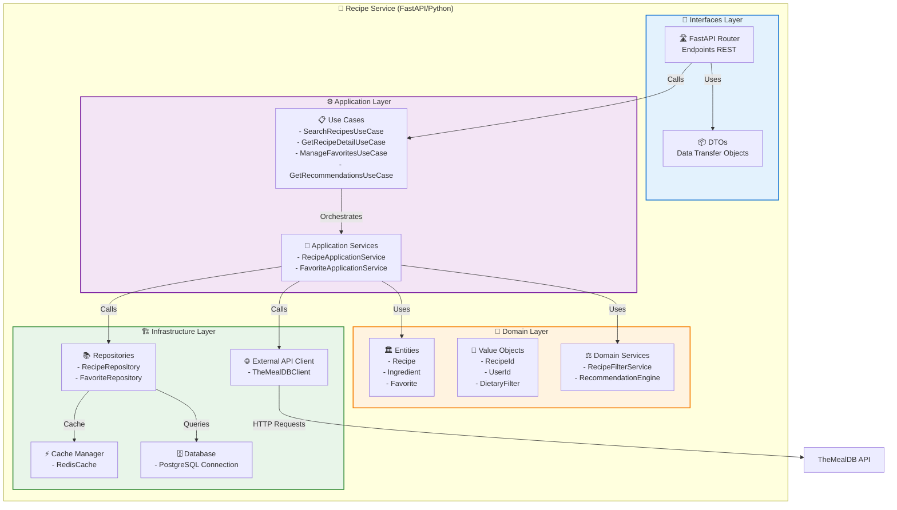

# C4 Model - Nivel 3: Diagrama de Componentes

## Recipe Service - Componentes Internos



---

## User Service - Componentes Internos

```mermaid
graph TB
    subgraph UserService["👥 User Service (Express.js/Node.js)"]
        subgraph API["📡 API Layer"]
            Routes[🛣️ Express Routes<br/>/api/v1/users/*]
            Middleware[🔒 Middleware<br/>- Validator<br/>- Error Handler]
        end

        subgraph ServiceLayer["⚙️ Service Layer"]
            UserServiceLogic[👤 User Service<br/>- registerUser()<br/>- getUserProfile()<br/>- updateDietaryFilter()<br/>- updateActivity()<br/>- validateUser()]
            FavoritesService[⭐ Favorites Service<br/>- manageFavorites()]
        end

        subgraph RepositoryLayer["📚 Repository Layer"]
            UserRepo[📦 User Repository<br/>- create()<br/>- findById()<br/>- update()<br/>- findActive()]
        end

        subgraph InfraLayer["🏗️ Infrastructure Layer"]
            DBConnection[🗄️ Database Connection<br/>- PostgreSQL Pool<br/>- Transaction Manager]
            Logger[📝 Logger<br/>- Winston/Morgan]
        end
    end

    Routes -->|Validate| Middleware
    Routes -->|Call| UserServiceLogic
    UserServiceLogic -->|CRUD| UserRepo
    UserRepo -->|Execute| DBConnection
    UserServiceLogic -->|Log| Logger

    style API fill:#e3f2fd,stroke:#1976d2,stroke-width:2px
    style ServiceLayer fill:#f3e5f5,stroke:#7b1fa2,stroke-width:2px
    style RepositoryLayer fill:#fff3e0,stroke:#f57c00,stroke-width:2px
    style InfraLayer fill:#e8f5e9,stroke:#388e3c,stroke-width:2px
```

---

## Recipe Service - Descripción de Componentes

### 📡 Interfaces Layer

#### FastAPI Router
- **Responsabilidad**: Exponer endpoints REST
- **Tecnología**: FastAPI decorators
- **Endpoints**: 8 endpoints principales
- **Validación**: Pydantic models

#### DTOs (Data Transfer Objects)
- **SearchRecipeDTO**: Request de búsqueda
- **RecipeResponseDTO**: Response de receta
- **FavoriteRequestDTO**: Agregar/eliminar favorito
- **RecommendationResponseDTO**: Lista de recomendaciones

---

### ⚙️ Application Layer

#### Use Cases
**SearchRecipesUseCase**
```python
async def execute(ingredients: List[str], user_id: int, dietary_filter: str) -> List[Recipe]
```
- Valida ingredientes (máx 3)
- Aplica filtros dietéticos
- Busca en cache primero
- Llama a TheMealDB
- Guarda en cache

**GetRecipeDetailUseCase**
```python
async def execute(recipe_id: str) -> Recipe
```
- Verifica cache
- Obtiene de TheMealDB
- Enriquece datos
- Guarda en cache

**ManageFavoritesUseCase**
```python
async def add_favorite(user_id: int, recipe_id: str, recipe_name: str) -> Favorite
async def remove_favorite(user_id: int, recipe_id: str) -> bool
async def list_favorites(user_id: int) -> List[Favorite]
```
- Límite de 10 favoritos
- Validación de duplicados
- CRUD en PostgreSQL

**GetRecommendationsUseCase**
```python
async def execute(user_id: int) -> List[Recipe]
```
- Analiza favoritos del usuario
- Considera filtro dietético
- Algoritmo de recomendación
- Retorna 5 recetas

#### Application Services
- Coordinan múltiples use cases
- Manejan transacciones
- Logging y monitoreo

---

### 💎 Domain Layer

#### Entities

**Recipe**
```python
class Recipe:
    id: str
    name: str
    category: str
    area: str
    instructions: str
    image_url: str
    ingredients: List[Ingredient]
    tags: List[str]
    dietary_info: DietaryInfo
```

**Ingredient**
```python
class Ingredient:
    name: str
    measure: str
```

**Favorite**
```python
class Favorite:
    user_id: int
    recipe_id: str
    recipe_name: str
    recipe_category: str
    created_at: datetime
```

#### Value Objects
- **RecipeId**: Identificador único de receta
- **UserId**: ID de usuario de Telegram
- **DietaryFilter**: Enum(none, vegetarian, vegan, gluten_free)

#### Domain Services

**RecipeFilterService**
```python
def filter_by_dietary_preference(recipes: List[Recipe], filter: DietaryFilter) -> List[Recipe]
```
- Lógica de filtrado
- Reglas de negocio

**RecommendationEngine**
```python
def generate_recommendations(user_favorites: List[Favorite], filter: DietaryFilter) -> List[Recipe]
```
- Algoritmo de recomendación
- Análisis de patrones

---

### 🏗️ Infrastructure Layer

#### RecipeRepository
```python
class RecipeRepository:
    async def save_recipe(recipe: Recipe) -> None
    async def find_by_id(recipe_id: str) -> Recipe
    async def search_by_ingredients(ingredients: List[str]) -> List[Recipe]
```

#### FavoriteRepository
```python
class FavoriteRepository:
    async def add_favorite(favorite: Favorite) -> Favorite
    async def remove_favorite(user_id: int, recipe_id: str) -> bool
    async def list_user_favorites(user_id: int) -> List[Favorite]
    async def count_user_favorites(user_id: int) -> int
```

#### TheMealDBClient
```python
class TheMealDBClient:
    async def search_by_ingredient(ingredient: str) -> List[Dict]
    async def get_recipe_by_id(recipe_id: str) -> Dict
    async def get_random_recipe() -> Dict
```
- Rate limiting
- Error handling
- Retry logic

#### RedisCache
```python
class RedisCache:
    async def get(key: str) -> Optional[Any]
    async def set(key: str, value: Any, ttl: int) -> None
    async def delete(key: str) -> None
```
- TTL: 24h para recetas
- Serialización JSON

---

## User Service - Descripción de Componentes

### 📡 API Layer

#### Express Routes
```javascript
router.post('/api/v1/users', registerUser)
router.get('/api/v1/users/:telegram_id', getUserProfile)
router.put('/api/v1/users/:telegram_id/filter', updateFilter)
router.post('/api/v1/users/:telegram_id/activity', updateActivity)
router.get('/api/v1/users/:telegram_id/validate', validateUser)
router.get('/api/v1/users-active', getActiveUsers)
```

#### Middleware
**Validator**
```javascript
- registerUser(): Valida telegram_id, username, nombres
- telegramIdParam(): Valida parámetro de ruta
- updateDietaryFilter(): Valida filtro dietético
```

**Error Handler**
```javascript
- handle(err, req, res, next): Manejo global de errores
- notFound(req, res): Handler 404
```

---

### ⚙️ Service Layer

#### UserService
```javascript
class UserService {
    async registerUser(userData)
    async getUserProfile(telegramId)
    async updateDietaryFilter(telegramId, filter)
    async updateActivity(telegramId)
    async getActiveUsers(days)
    async validateUser(telegramId)
}
```

**Lógica**:
- Validación de datos
- Reglas de negocio
- Coordinación con repositorio

---

### 📚 Repository Layer

#### UserRepository
```javascript
class UserRepository {
    async create(user)
    async findById(telegramId)
    async update(telegramId, data)
    async updateFilter(telegramId, filter)
    async updateLastActive(telegramId)
    async findActiveUsers(days)
}
```

**Patrón Repository**:
- Abstracción de persistencia
- Facilita testing
- Queries SQL optimizadas

---

## Patrones de Diseño Aplicados

### Recipe Service

1. **Clean Architecture (Hexagonal)**
   - Interfaces → Application → Domain → Infrastructure
   - Independencia de frameworks
   - Fácil testing

2. **Use Case Pattern**
   - Cada caso de uso encapsulado
   - Single Responsibility
   - Reutilizable

3. **Repository Pattern**
   - Abstracción de persistencia
   - Facilita cambio de BD

4. **External API Adapter**
   - Cliente TheMealDB
   - Desacopla API externa

5. **Cache-Aside Pattern**
   - Redis como cache
   - Reduce latencia

### User Service

1. **Layered Architecture**
   - API → Service → Repository → Infrastructure
   - Separación de responsabilidades

2. **Service Layer Pattern**
   - Lógica de negocio centralizada
   - Reusabilidad

3. **Repository Pattern**
   - Abstracción de datos
   - Queries optimizadas

4. **Middleware Chain**
   - Validación
   - Error handling
   - Logging

---

## Flujos de Datos

### Búsqueda de Recetas
```
Cliente → Router → UseCase → DomainService → Repository → Cache
                                         ↓
                                    ExternalAPI → TheMealDB
```

### Registro de Usuario
```
Cliente → Routes → Middleware → UserService → UserRepository → PostgreSQL
```

### Agregar Favorito
```
Cliente → Router → UseCase → FavoriteRepository → PostgreSQL
                                              ↓
                                         RecipeRepository (validación)
```
