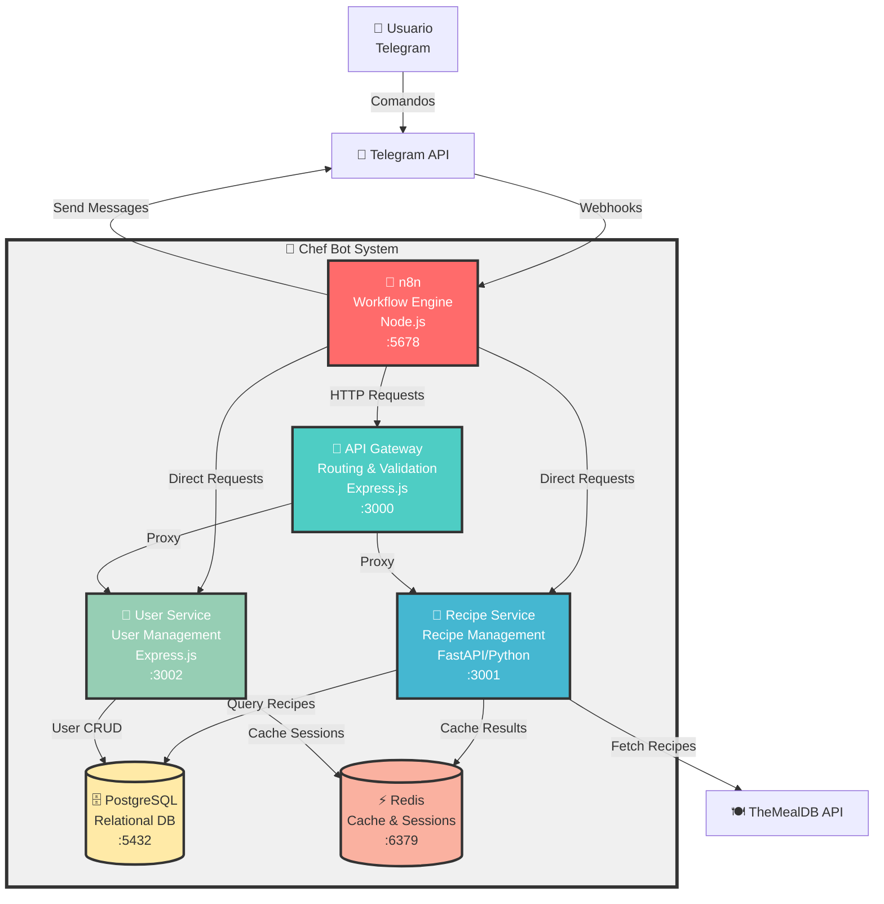

# C4 Model - Nivel 2: Diagrama de Contenedores

## Chef Bot - Arquitectura de Contenedores

## Descripción de Contenedores

### 1. **n8n - Workflow Engine** (Puerto 5678)
**Tecnología**: Node.js, n8n
**Responsabilidad**: Orquestación de workflows y lógica de negocio

**Funciones**:
- Recibe webhooks de Telegram
- Parsea comandos de usuario
- Orquesta flujos de trabajo (búsqueda, favoritos, filtros)
- Formatea respuestas para el usuario
- Envía mensajes a Telegram

**Conexiones**:
- Recibe: Webhooks de Telegram
- Envía: HTTP requests a servicios, mensajes a Telegram

---

### 2. **API Gateway** (Puerto 3000)
**Tecnología**: Node.js, Express.js
**Responsabilidad**: Routing, validación y punto de entrada único

**Funciones**:
- Rate limiting (100 req/min)
- Validación de requests
- Proxy a microservicios
- Health checks
- Logging y monitoreo

**Conexiones**:
- Recibe: Requests de n8n
- Proxy a: Recipe Service, User Service

---

### 3. **Recipe Service** (Puerto 3001)
**Tecnología**: Python, FastAPI
**Responsabilidad**: Gestión de recetas y búsquedas

**Funciones**:
- Búsqueda de recetas por ingredientes
- Obtener detalles de recetas
- Gestionar favoritos de usuario
- Actualizar filtros dietéticos
- Generar recomendaciones
- Cache de recetas en Redis

**Endpoints**:
- `GET /health` - Health check
- `GET /api/v1/recipes/{id}` - Detalle de receta
- `POST /api/v1/recipes/search` - Buscar recetas
- `GET /api/v1/users/{id}/recommendations` - Recomendaciones
- `POST /api/v1/users/{id}/favorites/{recipe_id}` - Agregar favorito
- `DELETE /api/v1/users/{id}/favorites/{recipe_id}` - Eliminar favorito
- `GET /api/v1/users/{id}/favorites` - Listar favoritos
- `PUT /api/v1/users/{id}/filter` - Actualizar filtro dietético

**Conexiones**:
- Consulta: PostgreSQL (recetas, favoritos)
- Cache: Redis (recetas, búsquedas)
- API Externa: TheMealDB

---

### 4. **User Service** (Puerto 3002)
**Tecnología**: Node.js, Express.js
**Responsabilidad**: Gestión de usuarios y perfiles

**Funciones**:
- Registro/actualización de usuarios
- Gestión de perfiles
- Filtros dietéticos por usuario
- Tracking de actividad
- Validación de usuarios

**Endpoints**:
- `GET /health` - Health check
- `POST /api/v1/users` - Registrar/actualizar usuario
- `GET /api/v1/users/{telegram_id}` - Obtener perfil
- `PUT /api/v1/users/{telegram_id}/filter` - Actualizar filtro
- `POST /api/v1/users/{telegram_id}/activity` - Actualizar actividad
- `GET /api/v1/users/{telegram_id}/validate` - Validar usuario
- `GET /api/v1/users-active` - Usuarios activos

**Conexiones**:
- CRUD: PostgreSQL (usuarios, perfiles)

---

### 5. **PostgreSQL** (Puerto 5432/5433)
**Tecnología**: PostgreSQL 15 Alpine
**Responsabilidad**: Almacenamiento persistente

**Bases de Datos**:
- `chef_db` - Base de datos principal

**Tablas**:
- `users` - Datos de usuarios
- `user_favorites` - Recetas favoritas
- `recipes_cache` - Cache de recetas
- `user_activity` - Log de actividad

---

### 6. **Redis** (Puerto 6379)
**Tecnología**: Redis 7 Alpine
**Responsabilidad**: Cache y sesiones

**Uso**:
- Cache de recetas de TheMealDB
- Resultados de búsquedas
- Sesiones de usuario
- Rate limiting

**TTL**:
- Recetas: 24 horas
- Búsquedas: 1 hora
- Sesiones: 7 días

---

## Patrones de Arquitectura Aplicados

### 1. **Microservicios**
- Separación de responsabilidades
- Servicios independientes y escalables
- Comunicación via HTTP/REST

### 2. **API Gateway Pattern**
- Punto de entrada único
- Rate limiting centralizado
- Routing y validación

### 3. **Cache-Aside Pattern**
- Redis como cache intermedio
- Reduce llamadas a API externa
- Mejora tiempos de respuesta

### 4. **Repository Pattern**
- Abstracción de acceso a datos
- Inyección de dependencias
- Facilita testing

### 5. **Service Layer Pattern**
- Lógica de negocio separada
- Reusabilidad de código
- Mejor mantenibilidad

---

## Principios SOLID Aplicados

✅ **Single Responsibility**: Cada servicio tiene una responsabilidad única
✅ **Open/Closed**: Servicios extensibles sin modificar código
✅ **Liskov Substitution**: Interfaces consistentes
✅ **Interface Segregation**: APIs específicas por dominio
✅ **Dependency Inversion**: Inyección de dependencias

---

## Comunicación entre Contenedores

### Sincrónica (HTTP/REST)
- n8n → Services: Requests HTTP
- Gateway → Services: Proxy HTTP
- Services → PostgreSQL: Queries SQL
- Services → Redis: Comandos Redis
- Recipe Service → TheMealDB: REST API

### Red Docker
- Todos los contenedores en red `chef-network`
- Comunicación por nombre de servicio
- Aislamiento de red externa

---

## Resiliencia

- **Health Checks**: Todos los servicios exponen `/health`
- **Timeouts**: 10s en requests HTTP
- **Retry Logic**: En llamadas a API externa
- **Circuit Breaker**: (Recomendado implementar)
- **Graceful Shutdown**: Cierre controlado de servicios
