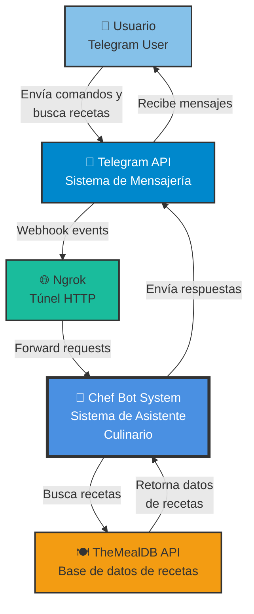

# C4 Model - Nivel 1: Diagrama de Contexto

## Chef Bot - Sistema de Asistente Culinario

## Descripción

### Sistema Principal
**Chef Bot System**: Sistema de asistente culinario inteligente que ayuda a usuarios a descubrir y gestionar recetas a través de Telegram.

### Actores Externos

1. **Usuario (Telegram User)**
   - Interactúa con el bot a través de la aplicación de Telegram
   - Envía comandos para buscar recetas, gestionar favoritos, etc.
   - Recibe respuestas interactivas con recetas y recomendaciones

2. **Telegram API**
   - Sistema de mensajería que facilita la comunicación
   - Envía webhooks cuando el usuario interactúa con el bot
   - Entrega las respuestas del bot al usuario

3. **Ngrok**
   - Túnel HTTP para desarrollo local
   - Permite que Telegram acceda al sistema local
   - Proporciona URL HTTPS pública

4. **TheMealDB API**
   - API externa de recetas
   - Proporciona datos de recetas, ingredientes, instrucciones
   - Acceso gratuito con miles de recetas

## Funcionalidades Principales

- 🔍 **Búsqueda de Recetas**: Por ingredientes (hasta 3)
- ⭐ **Gestión de Favoritos**: Guardar hasta 10 recetas
- 🥗 **Filtros Dietéticos**: Vegetariano, vegano, sin gluten
- 📏 **Conversión de Medidas**: Tazas, cucharadas, gramos, etc.
- 💡 **Recomendaciones**: Basadas en preferencias del usuario
- 📖 **Detalles de Recetas**: Ingredientes, instrucciones, imágenes

## Tecnologías de Comunicación

- **Webhook**: Telegram → Chef Bot (eventos en tiempo real)
- **REST API**: Chef Bot → TheMealDB (búsqueda de recetas)
- **Telegram Bot API**: Chef Bot → Telegram (envío de mensajes)
